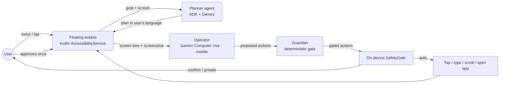

<p align="center"></p>

# NextStep

**An AI operator for a senior's smartphone.** Team Northstar · Google Cloud AI Builder Cup 2026 (JAPAC) · Theme: *Sustainability & Social Impact*

**Live:** family view and demo at https://nextstep-northstar.web.app (try [/demo](https://nextstep-northstar.web.app/demo)) · API on Cloud Run (`asia-south1`)

An older adult taps the NextStep bubble at the top-right of their Android phone and says what they want, in English, Hindi or Kannada: *"Order one litre of milk on Blinkit."* NextStep shows and reads out a short plan, the user approves it once, and NextStep **does the task in the real apps**: it opens Blinkit, searches, picks the item, adds it to the cart, reads out the total, and asks one final "yes" before placing a cash-on-delivery order.

It pauses only where a human must decide: passwords, OTPs, PINs, UPI approval and biometrics (the user does those privately), and irreversible steps like Send, Place order or Install (the user confirms first).

## How it works



| Gate | When | What NextStep does |
|---|---|---|
| `auto` | Routine steps covered by the approved plan (open app, search, scroll, back) | Does it |
| `confirm` | Send message or photo, place order, install app, add address, open payment page, Computer Use `require_confirmation` | Reads out exactly what will happen, waits for a spoken or tapped **yes** |
| `private` | Password, PIN, OTP, UPI, card or bank fields, any payment app | Hands over: "Please do this yourself, then tap Continue." Never sees or types the value |
| `blocked` | Unverified links in messages, anything before consent | Refuses and explains |

Safety is layered, and each layer can only make a gate stricter:
1. Gemini Computer Use safety policies and prompt-injection detection.
2. The server-side Guardian (`backend/app/guardian.py`).
3. The on-device SafetyGate (`SafetyGate.kt`), which re-checks every action against the live screen right before it runs.

A red **Stop now** button is visible throughout every task.

## Features

- **Persistent bubble** (top-right, every app). Tapping it opens a menu: Open an app · Understand this screen · Talk to NextStep · Close NextStep.
- **Autonomous tasks** on real apps: groceries on Blinkit (cash on delivery), WhatsApp medicine photo to the doctor, YouTube devotional songs, calls.
- **Understand this screen**: explains any screen in plain words, flags danger (for example "this page wants your UPI PIN") and offers *Take me back* / *Go home*.
- **Scam shield** (opt-in): checks WhatsApp/SMS notifications using rules (lookalike domains, KYC, OTP and urgency patterns) plus Gemini. It warns the user and offers only the verified official website, never the link from the message.
- **Languages**: English, हिंदी, ಕನ್ನಡ. Adding one means a JSON file plus a registry entry (see below).
- **No login, ever**: the senior just *says their name* during setup. NextStep creates an anonymous Firebase account bound to the phone under that name. There's no username, password or OTP.
- **Family view** (Firebase Hosting): the senior taps *Share with family* and NextStep sends a one-time link on WhatsApp. Family members open it and see a live timeline of tasks, scam alerts, and a stamp for every *yes*, *no* or private step. They never see the screen, photos, messages, passwords or OTPs. *Stop sharing* revokes access instantly. A public demo is at `/demo`.
- **Action log**: what NextStep saw, planned, asked and did.
- **Designed for older eyes and hands**: Atkinson Hyperlegible type, AAA-contrast palette (no pale blue/green distinctions), at least 64dp touch targets, every message spoken aloud, colour never the only signal.

## Architecture

| Layer | Tech |
|---|---|
| App UI | React Native + Expo (dev build), Expo Router, TypeScript |
| Phone control | Kotlin Expo module: AccessibilityService (tree, gestures, `takeScreenshot`), accessibility overlay, Intents, NotificationListenerService, Android SpeechRecognizer + TextToSpeech |
| Agents | **Google ADK** (Python): planner, screen explainer, scam shield, all with structured output |
| Phone operator | **Gemini Computer Use**, `environment: "mobile"`, Interactions API with server-side state |
| Backend | FastAPI on **Cloud Run** |
| Data | **Firestore** (tasks, profiles, family timeline; no screenshots, photos or message texts stored), **Secret Manager** (Gemini key), **Firebase Auth** (anonymous, voice-named accounts) |
| Family view | Vite + TypeScript on **Firebase Hosting**; `/api/**` is forwarded to Cloud Run (same origin) |

```
app/                         React Native app (Expo)
  src/app/                   screens: onboarding, talk, settings, log
  src/i18n/locales/          en.json, hi.json, kn.json
  modules/nextstep-agent/    Kotlin native module
    android/.../agent/
      NextStepAccessibilityService.kt   hosts everything below
      overlay/BubbleOverlay.kt          bubble, menu, app picker, task panel
      agent/AgentRunner.kt              on-device agent loop + yes/no dialogue
      exec/ActionExecutor.kt            Computer Use actions → gestures/intents
      safety/SafetyGate.kt              on-device gate (escalate-only)
      screen/ScreenReader.kt            accessibility tree + screenshot
      voice/VoiceIO.kt                  STT/TTS in the user's language
      notify/NotificationWatcher.kt     scam shield input (opt-in)
backend/                     Python, Cloud Run
  app/agents/                ADK agents: planner, explainer, scam_shield
  app/operator.py            Gemini Computer Use loop
  app/guardian.py            server-side gate
  app/official_sites.py      verified official URLs + lookalike detection
  app/family.py              family timeline events + invite/viewer sharing
dashboard/                   family view (Vite + TS): landing, join link, live timeline, demo
firebase.json                Hosting config (/api/** → Cloud Run)
infra/deploy-backend.sh      Cloud Run deploy
infra/deploy-dashboard.sh    Firebase Hosting deploy
assets/brand/                logo
```

## Setup

### Backend (local)

```bash
cd backend
python3 -m venv .venv && .venv/bin/pip install -r requirements-dev.txt
cp .env.example .env   # add GOOGLE_API_KEY
.venv/bin/python -m pytest -q
set -a; source .env; set +a; .venv/bin/uvicorn app.main:app --reload --port 8080
```

### Backend (Cloud Run)

See the comments at the top of `infra/deploy-backend.sh` for one-time project setup, then run:

```bash
./infra/deploy-backend.sh
```

### Family dashboard

```bash
cd dashboard && npm install && npm run dev   # http://localhost:5173 (proxies /api to :8080)
./infra/deploy-dashboard.sh                  # Firebase Hosting
```

### Android app (real device, Android 11+)

Requires a JDK 17 and the Android SDK, or use EAS cloud builds.

```bash
cd app
npm install
# point the app at your backend: app.json → expo.extra.apiBaseUrl
npx expo run:android --device
```

On the phone, onboarding walks through:
1. Choose a language.
2. Turn on **Settings → Accessibility → NextStep helper**.
3. Allow the microphone.
4. Optionally allow notification access for the scam check.

## Adding a language

1. Copy `app/src/i18n/locales/en.json` to `<code>.json` and translate it, including `yesWords` and `noWords`.
2. Add one entry to `LANGUAGES` in `app/src/i18n/index.tsx`.
3. Optionally add fixed Guardian phrases in `backend/app/i18n.py`. Unknown languages still work, with English fallbacks.

Voice, the overlay and model output follow the language tag automatically.

## Demo script (3 min)

1. "Order one litre of milk on Blinkit" in Hindi: plan, approval, autonomous search and cart, total read aloud, **yes**, COD order placed.
2. "Send a photo of my medicine to my doctor" in Kannada: camera, WhatsApp, contact, attach, then a pause before **Send**.
3. A fake SBI KYC SMS arrives: warning, "Open official website" opens onlinesbi.sbi. The message link is never touched.
4. A UPI PIN page appears and the user taps "Understand this screen": "Never share your PIN", then *Take me back*.

## Status

Implemented: overlay and menu, agent loop, Guardian and SafetyGate, screen explainer, scam shield, medicine photo flow, voice-named accounts, family view, voice, onboarding, i18n, action log. Backend tests pass (30), the app typechecks and lints clean, the Android APK builds, and the family view's invite, join, timeline and revoke flow is verified locally in a browser. Not yet verified: running on a physical device, and live Gemini calls.

Next:
- Cloud Speech-to-Text fallback for Kannada
- Device testing on Blinkit and WhatsApp

## Known limitations

- Android 11+ only (needs `AccessibilityService.takeScreenshot`). No iOS: iOS does not allow this kind of control.
- Real third-party apps change their UI. The operator works from screenshots plus the accessibility tree, but flows can still break and need retries.
- Some apps mark screens as secure (`FLAG_SECURE`). Screenshots there are black, so NextStep falls back to the accessibility tree.
